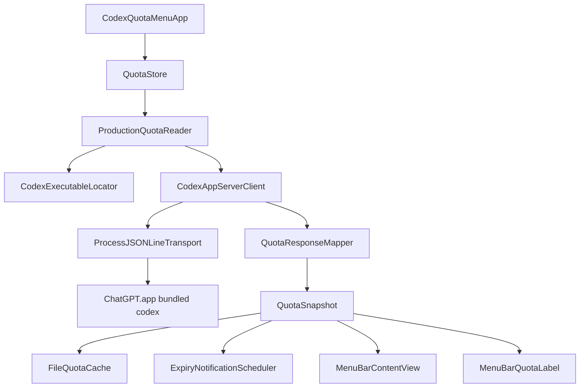

# Codex Quota Menu 复刻设计文档

> 本文档是 Codex Quota Menu 的完整复刻规格。将本文档复制到另一台 Mac 的 Codex 工作目录后，要求 Codex 先完整阅读本文，再按本文实现，不要自行替换数据源、调整业务含义或添加未声明的功能。

## 0. 给另一台 Codex 的直接执行提示词

```text
请完整阅读 CODEX_QUOTA_MENU_DESIGN.md，并在当前工作目录实现一个与文档完全一致的原生 macOS 菜单栏插件。

要求：
1. 先检查本机 ChatGPT.app 和 Codex 可执行文件路径；默认路径必须是
   /Applications/ChatGPT.app/Contents/Resources/codex。
2. 使用 Swift 5.10 / SwiftPM / SwiftUI + AppKit，最低 macOS 14.0。
3. 只通过 Codex App Server 的 JSONL stdio 协议读取数据，严格保持本文的四个出站方法：
   initialize、initialized、account/rateLimits/read、account/usage/read。
4. 绝对不能读取浏览器 Cookie、ChatGPT 凭据、Codex 状态数据库、对话日志，
   也不能实现任何 consume、redeem、write 类 App Server 方法。
5. 先写失败测试，再写实现；完成后必须运行：
   ./scripts/test.sh
   ./scripts/build-app.sh
   ./scripts/verify-app.sh
   ./scripts/install-app.sh
6. 交付前确认状态栏视觉为“每周剩余百分比 + 绿色/黄色/红色药丸”，药丸为原始 17×9 的约 1.4 倍，即 24×13；百分比在左，药丸在右。
7. 不要增加 Plus $20、Pro $200 标准线；本月价值只显示两个 API 假设场景，并明确它不是实际账单或订阅价值。
8. 如果现有实现与本文冲突，以本文的产品契约和验收条件为准；但不要删除已有的并发、缓存、通知、安装回滚和只读审计测试。
```

## 1. 产品定位

这是一个个人使用的原生 macOS 菜单栏应用，名称为 **Codex Quota Menu**，中文界面用于：

- 显示 Codex 每周剩余额度；
- 显示每个额度窗口的重置时间；
- 显示可用重置次数；
- 显示每个重置额度的到期时间，并在 24 小时内标记“即将到期”；
- 显示本月 Codex 使用 token 对应的两个 API 假设价值区间；
- 提供到期通知和登录时启动设置。

应用是 **只读** 的：不兑换、不消耗、不写入 Codex 额度，不修改 Codex 登录状态。

### 固定产品信息

| 项目 | 规格 |
|---|---|
| 应用名称 | Codex Quota Menu |
| Bundle ID | `local.scott.CodexQuotaMenu` |
| 版本 | `0.1.0`，Bundle version `1` |
| 最低系统 | macOS 14.0 |
| UI | SwiftUI + AppKit |
| 分发形式 | `Codex Quota Menu.app`，菜单栏常驻，不显示 Dock 图标 |
| UI 语言 | 简体中文，日期时间使用系统区域格式 |
| 外部依赖 | 不使用第三方 Swift Package |

## 2. 状态栏设计

### 2.1 排列和尺寸

状态栏必须显示：

```text
65%  [绿色药丸]
```

百分比在左，药丸在右。药丸内部使用当前每周剩余额度的比例填充。

尺寸基准：

- 原始药丸基准：`17×9`；
- 当前产品尺寸：约 `1.4×`，使用 `24×13`；
- 状态栏绘制图片高度：`19`；
- 状态栏动态图片宽度：`max(60, textWidth + 30)`；
- 百分比字体：monospaced digit，13 pt，semibold；
- 百分比文字颜色：固定为白色（`NSColor.white`）；
- 文字与药丸间距：5 pt；
- 药丸圆角半径：药丸高度的一半；
- 内边距：1.5 pt；
- 边框：白色、约 70% 透明度、1.5 pt。

状态栏不要使用 `GeometryReader`，不要使用会在 `MenuBarExtra` 中被忽略或重排的多子视图布局。推荐使用 `NSImage(size:)` 绘制一个包含“百分比 + 药丸”的完整非模板图片，并设置：

```swift
image.isTemplate = false
```

这样可以保证百分比在药丸左侧，同时保留彩色填充。

### 2.2 颜色阈值

颜色只针对每周窗口（`durationMinutes == 10_080`）：

| 每周剩余 | 状态 | 药丸填充色 |
|---:|---|---|
| `>= 20%` | normal | `NSColor.systemGreen` |
| `10%...19%` | warning | `NSColor.systemYellow` |
| `< 10%` | critical | `NSColor.systemRed` |

非每周窗口不参与状态栏颜色判断。加载中、没有每周窗口或不可用时，药丸不填充，显示灰色边界或等价的不可用视觉。

### 2.3 状态栏数据来源

- 只取 `durationMinutes == 10_080` 的窗口；
- 显示 `remainingPercent = 100 - clamped(usedPercent, 0...100)`；
- `fillFraction = Double(remainingPercent) / 100`；
- 数据过期时，百分比文本追加 ` !`，辅助功能标签追加“数据可能已过期”；
- 没有可用每周窗口时，文本显示 `--`，不可用时显示 `不可用`。

## 3. 点击后的菜单面板

使用 SwiftUI `MenuBarExtra`，样式为 `.window`，面板固定宽度 `330`，内边距 `14`，垂直间距 `12`。

面板内的额度窗口百分比数字固定为黑色；这与状态栏药丸左侧的白色百分比是两个独立的显示路径。

### 3.1 顶部

左侧标题：`Codex 额度`。

右侧：

- 刷新中显示小型 `ProgressView`；
- 刷新按钮使用 `arrow.clockwise`；
- 刷新按钮在刷新期间禁用；
- 无障碍标签：`刷新额度`。

### 3.2 额度窗口

每个 `QuotaWindow` 显示：

1. 左侧窗口标签；
2. 右侧剩余百分比，例如 `65%`；
3. 一条 `ProgressView(value: remainingPercent, total: 100)`；
4. 窗口颜色使用第 2.2 节的每周阈值逻辑；
5. 有 `resetsAt` 时显示：`重置：<系统格式日期时间>`。

典型标签：

- `5 小时额度`（300 分钟）；
- `每周额度`（10,080 分钟）；
- 未知窗口优先使用后端 `limitName`，否则使用 `Codex 额度`。

### 3.3 本月 API 假设场景

额度窗口后显示分隔线，再显示独立的 `MonthlyUsageValueSection`。

标题：`Sol API 假设场景`。

右侧显示区间：

```text
$缓存较多情景～$输出较多情景
```

显示两个场景：

- 缓存较多情景：绿色方块；
- 输出较多情景：黄色方块。

固定构成文本必须是：

```text
固定构成：80/15/5 · 40/40/20
```

说明文本必须包含：

```text
本月 <tokenText> · GPT-5.6 Sol 标准 API 价格
情景估算，并非实际账单或订阅价值
```

不要显示或实现以下内容：

- `Plus $20`；
- `Pro $200`；
- `$250`；
- “本月 API 等价价值”作为绝对账单结论；
- 任何节省金额、订阅价值或确定性 ROI 结论。

轨道图：

- 背景为灰色胶囊；
- 缓存较多情景使用绿色段；
- 输出较多情景超过绿色段的部分使用绿色到黄色渐变；
- 轨道高度 9 pt；
- 刻度为 `$0`、动态中点、动态最大值。

### 3.4 重置次数和到期时间

继续显示分隔线，然后显示：

```text
可用重置次数                         3
```

每条重置额度只显示简洁信息，不显示后端长描述：

```text
第一次                         到期：2026年8月1日 4:37
第二次                         到期：2026年8月12日 5:10
第三次                         到期：2026年8月13日 2:14
```

序号规则：

- 第 1～10 条使用 `第一次`、`第二次`……`第十次`；
- 超过 10 条使用 `第11次`、`第12次`……；
- 无到期时间显示 `不过期`；
- 到期时间在未来 24 小时内，右侧显示橙色 `即将到期` 和警告图标；
- 不显示后端 `title`、`description` 或“Thanks for using Codex…”文案。

底部显示：

```text
最后更新：<时间>
```

### 3.5 设置和底部操作

保留以下控件：

- `登录时启动` Toggle；
- `到期通知` Toggle；
- 通知权限被拒绝时显示橙色提示：`通知权限未启用；额度显示不受影响。`；
- 登录项异常时显示系统设置提示；
- `打开 ChatGPT` 按钮，打开 `/Applications/ChatGPT.app`；
- `退出` 按钮，调用 `NSApplication.shared.terminate(nil)`。

## 4. 数据和协议设计

### 4.1 Codex 可执行文件

默认且必须优先支持的路径：

```text
/Applications/ChatGPT.app/Contents/Resources/codex
```

启动参数：

```text
app-server --stdio
```

不调用浏览器，不解析 CLI 文本，不读取 ChatGPT 网页。

### 4.2 允许的 App Server 方法

整个源码只能有以下四个 App Server 方法，并且只能在 `CodexAppServerClient.swift` 中发送：

| 方法 | 用途 |
|---|---|
| `initialize` | 初始化客户端信息 |
| `initialized` | 完成初始化握手 |
| `account/rateLimits/read` | 读取额度窗口和重置额度 |
| `account/usage/read` | 读取账户使用量 |

精确出站 JSON：

```json
{"method":"initialize","id":0,"params":{"clientInfo":{"name":"codex_quota_menu","title":"Codex Quota Menu","version":"0.1.0"}}}
{"method":"initialized","params":{}}
{"method":"account/rateLimits/read","id":1,"params":null}
{"method":"account/usage/read","id":2,"params":null}
```

禁止出现：

- `account/rateLimitResetCredit/consume`；
- `consume`；
- `redeem`；
- `write`；
- 任何其他写入或兑换方法。

`account/usage/read` 失败时，仍保留本次成功读取的额度窗口，并将 usage 标记为不可用；不能让 usage 辅助数据失败导致额度主显示消失。

### 4.3 JSONL 传输和生命周期

`ProcessJSONLineTransport` 负责：

- `Process` 启动 Codex 子进程；
- stdin/stdout 管道；
- stdout 按换行拆分 JSONL；
- 单一 receive owner，避免并发读取同一流；
- `F_SETNOSIGPIPE`，避免写入已关闭管道时触发 SIGPIPE；
- graceful stop 后在 100 ms 内强制终止不合作子进程；
- stop 后关闭文件句柄、结束 reader task、回收子进程；
- generation/lifecycle 保护，避免旧任务在重启后污染新状态。

`CodexAppServerClient` 负责：

- 初始化握手；
- request/response ID 匹配；
- 响应超时默认 10 秒；
- 每次读取最多尝试两次；
- 传输失败后重建 transport；
- 并发读取复用同一个 in-flight task；
- shutdown 可重复调用，且不会让已取消读取复活。

### 4.4 额度映射

`QuotaResponseMapper` 规则：

1. 如果 `rateLimitsByLimitId` 非空，按 key 排序后处理每个 bucket；
2. 否则使用 legacy `rateLimits` 作为 `codex` bucket；
3. 每个 bucket 处理 `primary` 和 `secondary`；
4. `windowDurationMins` 和 `resetsAt` 允许为空；
5. `usedPercent` 最终通过 `QuotaWindow.remainingPercent` 限制在 0～100；
6. 没有任何窗口时抛出 `noQuotaWindows`；
7. 额度标签使用 300 分钟、10,080 分钟的中文固定标签；
8. 只映射 status 为 `available` 的 reset credits；
9. reset credit 按到期时间升序排列，无到期时间排最后；
10. 后端 ID 不直接落盘，使用：

```text
SHA256(backendID + NUL + expiresAtEpochSecondsOrNever)
```

### 4.5 本月 usage 映射

`MonthlyUsageMapper` 只累计当前日历月：

- 使用系统传入的 `Calendar`；
- 只接受严格的 `YYYY-MM-DD` 日期；
- 日期必须是真实日期；
- 月初包含，下一月月初不包含；
- 负 token 抛出错误；
- `Int64` 溢出抛出错误；
- 其他月份直接忽略；
- 保存 `monthStart`、总 token 数、`fetchedAt`。

### 4.6 API 假设价值

估算只使用本月派生 token 总数，不使用账户账单数据：

```text
cachedHeavyUSD = max(tokens, 0) / 1,000,000 × 2.65
outputHeavyUSD = max(tokens, 0) / 1,000,000 × 8.20
```

展示为两个固定场景：

- 缓存较多：`80/15/5`，缓存较多的 GPT-5.6 Sol 标准 API 假设价格；
- 输出较多：`40/40/20`，输出较多的 GPT-5.6 Sol 标准 API 假设价格。

动态最大刻度：

- 最小为 `$50`；
- 大于 `$50` 时，在 `1×10^n`、`2×10^n`、`5×10^n` 中取第一个不小于输出场景价值的数；
- 两个场景的 fraction 都限制在 0～1。

## 5. 状态、缓存和通知

### 5.1 QuotaStore

`QuotaStore` 是 `@MainActor` 的 `ObservableObject`：

- `state`：loading / fresh / stale / unavailable；
- `lastErrorMessage`：辅助错误；
- `isRefreshing`：刷新状态；
- `notificationsEnabled`；
- `notificationPermission`；
- 启动时先加载缓存，再立即刷新；
- 自动刷新间隔：300 秒；
- 手动刷新与启动刷新合并为一个任务；
- stop 会取消 refresh、loop，并等待 reader shutdown；
- generation 防止旧任务写回新状态。

### 5.2 缓存

文件：

```text
~/Library/Application Support/Codex Quota Menu/quota-cache.json
```

使用 seconds-since-1970 编解码，原子写入。缓存内容只包括显示快照和派生 monthly usage，不包括凭据、原始 reset credit ID 或 Codex 状态数据库。

缓存超过 1,800 秒视为 stale，但 stale 快照仍可显示，并提示数据可能过期。

### 5.3 到期通知

默认启用，可通过 `到期通知` 关闭。

- 只为未来且有 `expiresAt` 的 available credit 规划通知；
- 首选在过期前 24 小时触发；
- 若已经进入 24 小时窗口，则在当前时间后 1 秒触发；
- 通知 ID 必须是 `codex-` + 64 位小写 SHA-256；
- 只清理自身前缀的 pending request；
- 通知 ledger 存在 `local.scott.CodexQuotaMenu` 的 UserDefaults；
- 关闭通知时删除自身 pending request 和 ledger；
- 通知权限被拒绝不影响额度显示。

### 5.4 登录时启动

使用 `SMAppService.mainApp`：

- enabled：Toggle 为开；
- notRegistered：Toggle 为关；
- requiresApproval：显示系统设置批准提示；
- notFound：显示不可用提示；
- 首次运行默认尝试注册一次；
- 使用 UserDefaults 标记已完成首次配置，避免反复注册。

## 6. 架构和文件职责



### 源码文件表

| 文件 | 职责 |
|---|---|
| `Sources/CodexQuotaMenu/App/CodexQuotaMenuApp.swift` | App 入口、依赖组装、`MenuBarExtra`、window 样式 |
| `Sources/CodexQuotaMenu/Protocol/AppServerWireModels.swift` | App Server JSON 解码模型 |
| `Sources/CodexQuotaMenu/Services/CodexExecutableLocator.swift` | 定位 ChatGPT.app 内的 Codex 可执行文件 |
| `Sources/CodexQuotaMenu/Services/JSONLineTransport.swift` | JSONL 传输协议接口和错误 |
| `Sources/CodexQuotaMenu/Services/ProcessJSONLineTransport.swift` | 子进程、管道、JSONL reader、SIGPIPE 和 shutdown |
| `Sources/CodexQuotaMenu/Services/CodexAppServerClient.swift` | 唯一允许发送 App Server 请求的客户端 |
| `Sources/CodexQuotaMenu/Services/QuotaReader.swift` | 生产 reader、client 生命周期和 shutdown |
| `Sources/CodexQuotaMenu/Services/QuotaResponseMapper.swift` | wire response 到领域模型的映射 |
| `Sources/CodexQuotaMenu/Domain/QuotaModels.swift` | 额度窗口、reset credit、快照、显示状态 |
| `Sources/CodexQuotaMenu/Domain/MonthlyUsage.swift` | 当前月 token 汇总 |
| `Sources/CodexQuotaMenu/Domain/APIEquivalentValueEstimator.swift` | 两个 API 假设场景的 Decimal 计算 |
| `Sources/CodexQuotaMenu/Persistence/QuotaCache.swift` | Application Support JSON 缓存 |
| `Sources/CodexQuotaMenu/Notifications/ExpiryNotificationScheduler.swift` | 到期通知计划、ledger、UserNotifications gateway |
| `Sources/CodexQuotaMenu/System/LaunchAtLoginController.swift` | SMAppService 登录项控制 |
| `Sources/CodexQuotaMenu/System/ApplicationTerminationCoordinator.swift` | 退出时等待异步清理 |
| `Sources/CodexQuotaMenu/UI/QuotaStore.swift` | 主线程状态、刷新循环、缓存和通知协调 |
| `Sources/CodexQuotaMenu/UI/MenuBarPresentation.swift` | 状态栏文本、fraction、band、辅助功能文本 |
| `Sources/CodexQuotaMenu/UI/MenuBarQuotaLabel.swift` | 绘制百分比和 24×13 彩色药丸的非模板 NSImage |
| `Sources/CodexQuotaMenu/UI/QuotaProgressPresentation.swift` | 每周额度颜色阈值 |
| `Sources/CodexQuotaMenu/UI/MenuBarContentView.swift` | 点击状态栏后的完整面板 |
| `Sources/CodexQuotaMenu/UI/MonthlyUsageValueSection.swift` | API 假设价值区间和轨道图 |
| `Sources/CodexQuotaMenu/UI/APIEquivalentValuePresentation.swift` | 价值文字、刻度和 fraction 格式化 |
| `Sources/CodexQuotaMenu/UI/ResetCreditRowPresentation.swift` | 中文序号格式化 |

## 7. App 包配置

`Resources/Info.plist` 必须包含且只包含以下关键字段：

```xml
CFBundleDevelopmentRegion = zh_CN
CFBundleDisplayName = Codex Quota Menu
CFBundleExecutable = CodexQuotaMenu
CFBundleIdentifier = local.scott.CodexQuotaMenu
CFBundleInfoDictionaryVersion = 6.0
CFBundleName = Codex Quota Menu
CFBundlePackageType = APPL
CFBundleShortVersionString = 0.1.0
CFBundleVersion = 1
LSMinimumSystemVersion = 14.0
LSUIElement = true
NSHighResolutionCapable = true
```

`LSUIElement=true` 是菜单栏应用不显示 Dock 图标的关键。

SwiftPM 包配置：

```swift
// swift-tools-version: 5.10
platforms: [.macOS(.v14)]
name: CodexQuotaMenu
product: executable CodexQuotaMenu
language: Swift 5
```

不添加第三方依赖。

## 8. 构建、测试和安装

必须使用仓库脚本，不要直接用没有缓存隔离参数的裸 `swift test`。

### 测试

```bash
./scripts/test.sh
```

当前完整测试套件为 171 项，覆盖：

- App Server request/response、超时、重试、并发和 shutdown；
- JSONL framing、空行、尾部 fragment、无效 UTF-8；
- 额度映射、窗口排序、reset credit 过滤；
- 每周颜色阈值 20% 和 10% 边界；
- 月度 token 汇总和 Decimal API 假设价值；
- QuotaStore 的缓存、刷新、stale、stop 和并发；
- 通知计划、权限、ledger、过期清理；
- 登录项控制器；
- Bundle、Info.plist、构建脚本、安装脚本和只读审计。

真实账户 smoke test 默认关闭，只能在明确批准后运行：

```bash
RUN_LIVE_CODEX_TESTS=1 ./scripts/test.sh --filter LiveCodexSmokeTests
```

### 构建

```bash
./scripts/build-app.sh
```

输出：

```text
dist/Codex Quota Menu.app
```

构建脚本必须：

- 使用项目 `.build` 下的 SwiftPM/module cache；
- 默认 `CODEX_QUOTA_INTERFACE_COMPILER_VERSION=6.3.2`；
- `swift build -c release`；
- 复制可执行文件和 Info.plist；
- 使用 ad hoc `codesign --force --sign -`；
- 不使用 `--deep`。

### 验证

```bash
./scripts/verify-app.sh
```

验证内容：

- Info.plist 所有字段；
- bundle 签名和 Designated Requirement；
- ad hoc 签名；
- 出站方法审计；
- 只读 fake-client 测试；
- 重新构建 release executable；
- 将新构建和 bundle executable 做字节级 `cmp`。

### 安装

```bash
./scripts/install-app.sh
```

安装前必须退出正在运行的 `CodexQuotaMenu`。安装器：

1. 验证 dist bundle；
2. 在 `/Applications/.codex-quota-menu-install.XXXXXX` 创建 staging；
3. 编译 `atomic-swap`；
4. 验证 staging bundle；
5. 原子替换 `/Applications/Codex Quota Menu.app`；
6. 验证安装结果；
7. 失败时回滚旧 bundle；
8. 回滚失败时保留恢复目录并报告路径；
9. 成功后用 `open -n` 启动；
10. 不使用 sudo。

## 9. 只读安全边界

禁止读取：

- 浏览器 Cookie；
- ChatGPT 登录凭据；
- Codex authentication files；
- Codex state database；
- 对话日志；
- session logs。

允许保存：

- 最新 `QuotaSnapshot` 显示缓存；
- 当前月派生 token 总数；
- 月初和抓取时间；
- reset credit 的匿名 SHA-256 通知 key；
- 通知和登录项偏好。

出站审计脚本 `scripts/audit-outbound-methods.sh` 是硬性边界。任何其他 Swift 文件出现 `.send` 引用都必须失败；源码总共必须只有四个 send payload。

## 10. 卸载

按以下顺序：

1. 在菜单中关闭 `到期通知`，清理自身 pending notifications；
2. 关闭 `登录时启动`；
3. 退出应用；
4. 删除 `/Applications/Codex Quota Menu.app`；
5. 可选删除 `~/Library/Application Support/Codex Quota Menu`；
6. 删除 UserDefaults：

```bash
defaults delete local.scott.CodexQuotaMenu
```

## 11. 复刻验收清单

在另一台电脑上完成后，必须逐项确认：

- [ ] 菜单栏没有 Dock 图标；
- [ ] 状态栏显示 `每周剩余百分比 + 右侧药丸`；
- [ ] 药丸尺寸约 `24×13`，不是 34×18；
- [ ] `>=20%` 为绿色，`10%...19%` 为黄色，`<10%` 为红色；
- [ ] 药丸填充比例对应每周剩余额度；
- [ ] 点击后面板宽度为 330；
- [ ] 面板有每周额度、重置时间、API 假设场景、重置次数、到期时间、最后更新时间；
- [ ] reset credit 使用中文第一次/第二次/第三次；
- [ ] 24 小时内到期显示橙色“即将到期”；
- [ ] 没有 Thanks for using Codex 文案；
- [ ] 没有 Plus $20 / Pro $200 标准线；
- [ ] 到期通知可开关，登录时启动可开关；
- [ ] 退出和打开 ChatGPT 按钮正常；
- [ ] `./scripts/test.sh` 通过；
- [ ] `./scripts/verify-app.sh` 通过；
- [ ] 安装后的 executable 与当前 release 构建字节一致；
- [ ] `account/rateLimitResetCredit/consume` 不存在；
- [ ] 没有浏览器抓取、凭据读取或 Codex 状态数据库读取。

## 12. 当前实现参考

本文档对应的参考实现位于：

```text
/Users/scott/Documents/Codex/2026-05-28/codex-codex/codex-quota-menu
```

参考实现当前主分支提交：

```text
3238eb82e801bd0e8f223a78b56b1790a0b62fda
```

如果另一台电脑可以访问 Git 仓库，优先同时复制本文档和整个 `codex-quota-menu` 目录；如果只有本文档，则按第 0 节提示词从空 SwiftPM 项目重建，并以本文的文件表、协议、UI 尺寸、测试和验收清单作为唯一产品契约。
